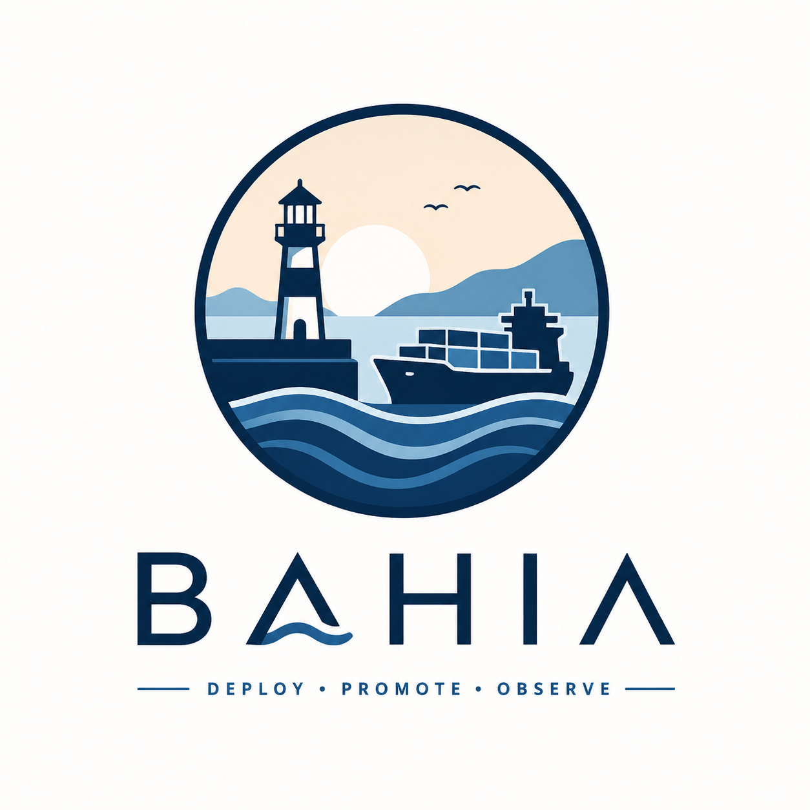

# Bahia



## What is Bahia?

**Bahia tracks your builds, deploys your containers, and tells you when something goes wrong.**

Think of it as a deployment dashboard that:
- Knows which code versions are deployed where
- Deploys containers to remote servers via [Loom](../loom-worker) workers
- Detects when running containers don't match what you deployed (drift detection)
- Records everything to [Nostr](https://nostr.com) relays for a tamper-proof audit trail
- Handles rollbacks when things go wrong
- Optionally provisions AI agents with full infrastructure ([Soul Factory](docs/soul-factory.md))

---

## How It Works

```
You push code → CI builds it → Bahia registers the artifact → You deploy → Loom workers run it → Bahia watches it
```

**The pieces:**
- **Hive-CI / Loom** — Builds your code, tells Bahia about it
- **Harbor** — Stores your container images
- **Bahia** — Tracks everything, coordinates deployments
- **Loom Workers** — Run the actual `docker pull && docker run` commands on target servers
- **Nostr Relays** — Store signed events for audit trail

## Architecture

```
┌─────────────┐     ┌──────────┐     ┌───────────┐
│  Hive-CI    │────▶│  Bahia   │────▶│   Loom    │
│  (builds)   │     │ Registry │     │ (workers) │
└─────────────┘     └────┬─────┘     └───────────┘
                         │
                    ┌────┴────┐
                    │         │
               ┌────▼───┐ ┌───▼─────┐
               │ Harbor │ │ Docker  │
               │(images)│ │(runtime)│
               └────────┘ └─────────┘
                    │         │
               ┌────▼─────────▼──┐
               │   PostgreSQL    │
               │  (state store)  │
               └────────┬────────┘
                        │
               ┌────────▼────────┐
               │  Nostr Relays   │
               │ (audit trail)   │
               └─────────────────┘
```

## Current Status

- ✅ Service, environment, build, artifact registration
- ✅ Deployment intents with approval workflows
- ✅ Deployment execution via Loom workers
- ✅ Runtime observation and drift detection (Docker, Podman, Compose, Kubernetes)
- ✅ Rollback workflows with blue-green/canary support
- ✅ SBOM parsing (SPDX and CycloneDX)
- ✅ Cashu wallet for worker payments
- ✅ Nostr event publishing for audit trail
- ✅ PostgreSQL persistence
- ✅ REST API and CLI
- ✅ Web UI for browsing services, environments, and deployments
- ✅ Soul Factory agent provisioning (experimental)
- ✅ **OCI Registry Server** — internal container registry backed by PostgreSQL + Blossom
- ✅ **Hive-CI Bridge** — auto-ingest CI events (kind 5401/5402) and create builds/artifacts/deployments

See [protocol-compatibility.md](docs/protocol-compatibility.md) for integration details.

## Quick Start

```bash
# Start with Docker Compose (includes PostgreSQL)
docker compose up --build

# API is at http://localhost:8080
curl http://localhost:8080/health
```

## Development

```bash
# Prerequisites: Go 1.24+, PostgreSQL 16+

# Install dependencies
make deps

# Run locally
make run-dev

# Run tests
make test

# Build binaries
make build
```

## API

Full API docs: [docs/api.md](docs/api.md)

### Key Endpoints

| Endpoint | Description |
|----------|-------------|
| `POST /api/v1/services` | Register a service |
| `POST /api/v1/builds` | Register a build |
| `POST /api/v1/artifacts` | Register an artifact |
| `POST /api/v1/deployments/intents` | Create deployment intent |
| `POST /api/v1/rollback` | Roll back a deployment |
| `GET /api/v1/state/drifted` | List drifted deployments |
| `GET /v2/` | OCI Distribution API (registry) |
| `GET /v2/{name}/manifests/{ref}` | Pull container manifest |
| `PUT /v2/{name}/manifests/{ref}` | Push container manifest |
| `POST /v2/{name}/blobs/uploads/` | Start blob upload |

## CLI

```bash
bahia services list
bahia environments list
bahia state list
bahia state drifted
bahia deploy --service <id> --environment <id> --artifact <id> --requested-by <user>
bahia rollback --service <id> --environment <id> --requested-by <user>
```

## Key Concepts

| Term | What it means |
|------|---------------|
| **Service** | An application you deploy (e.g., "api", "frontend") |
| **Environment** | Where you deploy to (e.g., "staging", "production") |
| **Build** | A CI run that produced an artifact |
| **Artifact** | A container image with metadata (digest, SBOM, signature) |
| **Deployment Intent** | A request to deploy an artifact to an environment |
| **Deployment Run** | The actual execution of a deployment by a Loom worker |
| **Drift** | When what's running doesn't match what should be running |

## Documentation

- [Architecture](docs/architecture.md) — How Bahia is structured
- [API Reference](docs/api.md) — REST API endpoints
- [Deployment Guide](docs/deployment.md) — How to run Bahia
- [Event Specification](docs/event-spec.md) — Nostr event kinds used
- [Protocol Compatibility](docs/protocol-compatibility.md) — Nostr/Loom/Cashu integration status
- [Nostr Commands](docs/nostr-commands.md) — Operating Bahia via Nostr events
- [Soul Factory](docs/soul-factory.md) — AI agent provisioning

## License

See [LICENSE](LICENSE) for details.
