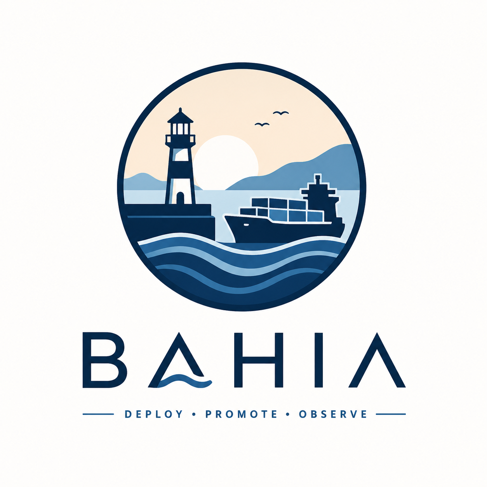

# Bahia



**Bahia tracks your builds, deploys your containers, and tells you when
something goes wrong.**

Bahia is a deployment and runtime control plane whose state lives on Nostr
relays as signed events. It:

- registers builds and artifacts from CI (Hive-CI) and its own OCI registry;
- holds the desired state of every service in every environment;
- executes deployments and rollbacks on Loom workers or direct runtime
  targets (Docker, Compose, Kubernetes, Podman);
- observes what is running, detects drift, supervises managed instances and
  probes public routes;
- publishes every state change, status and audit fact to relays, where the
  web app, the CLI, MCP agents and other services read it;
- optionally manages DNS, LLM routes, ML models, packages, backups, security
  scanning, SBOMs and Soul Factory agents.

## How it works

```text
you push code → Hive-CI builds it → Bahia registers the build and artifact
→ an operator signs a deployment intent → Bahia evaluates policy, runs it
→ Bahia observes the runtime → Bahia publishes state, status and audit to relays
→ the web app, CLI and agents see it live
```

```text
 web (SvelteKit)      bahia CLI       MCP agents
      │ REQ + signed intents │             │ POST /mcp
      ▼                      ▼             ▼
 ┌───────────── relay sidecar (bahia-relay) ─────────────┐
 │ intents · state 30900 · status 30315 · audit 4903     │
 └──────────────────▲────────────────────▲───────────────┘
                    │ publish            │ subscribe
               ┌────┴──── bahia daemon ──┴────┐
               │ intent processor · registry   │
               │ projector · supervisors        │
               └──┬───────┬───────┬────────┬───┘
            PostgreSQL  Blossom  OCI    Loom / runtimes
             (index)   (blobs) (images)
```

Every mutation is a client-signed Nostr intent; the daemon answers with a
bounded status and publishes the canonical record; readers subscribe. HTTP
exists for probes, metrics, the OCI distribution API, MCP and a handful of
HTTP-native routes.

## Quick start

```bash
# A Nostr key for the daemon and the host docker socket group id
export BAHIA_NOSTR_PRIVATE_KEY=<64-hex>
export DOCKER_SOCKET_GID=$(stat -c %g /var/run/docker.sock)
# The web app trusts only the service pubkeys you name
export PUBLIC_BAHIA_SERVICE_PUBKEYS=<service-pubkey-hex>

docker compose up --build

curl http://localhost:8080/health      # liveness
curl http://localhost:8080/ready       # readiness with checks
open http://localhost:3000             # web app (relay proxied at /relay)
```

`docker-compose.yml` starts PostgreSQL, the relay sidecar (`:3334`), the
daemon (`:8080`) and the web app (`:3000`); the Go services share
`config.compose.yaml`. See the [deployment guide](docs/deployment.md).

## Development

```bash
# Go 1.26, PostgreSQL 16, pnpm 10 / Node 22+ for the web
make deps        # go mod download
make run-dev     # daemon with dev-mode config
make test        # go test ./... (includes the architecture ratchet)
make lint        # golangci-lint
make build       # bahia-server, bahia, bahia-relay and the other binaries
```

Binaries (`cmd/`): `server` (`bahia-server`), `cli` (`bahia`), `relay`
(`bahia-relay`), `bahia-migrate`, `bahia-event-archive`, `bahia-dns-agent`,
`bahia-test-relay`, `fips-bahia-bridge`, `openclaw-soulfactory-sidecar`,
`openclaw-soulfactory-control`, `metiq-signet-enrollment`,
`soulfactory-runtime-validate`, `soulfactory-legacy-adoption-report`,
`bahia-assistant-e2e-provider`.

## CLI

```bash
bahia services list
bahia environments list
bahia state list
bahia state drifted
bahia deploy --org <org-id> --service <id> --environment <id> --artifact <id>
bahia rollback --org <org-id> --service <id> --environment <id> \
  --deployment-unit <unit-id> --target-artifact <previous-artifact-id> \
  --supersedes-intent <current-intent-id>
bahia outbox list
```

The CLI signs with a key file or a NIP-46 bunker, talks to relays only, and
follows the daemon's status events. Full reference:
[CLI](docs/user-guide/cli-reference.md).

## Key concepts

| Term | Meaning |
|---|---|
| **Service** | An application you deploy |
| **Environment** | A target context such as staging or production, with one or more deployment units |
| **Build** | A CI run that produced deployable output |
| **Artifact** | An immutable container image plus metadata |
| **Deployment intent** | A signed request to deploy an artifact, with its policy evaluation and approval |
| **Deployment run** | One execution attempt of an approved intent |
| **Runtime observation** | A snapshot of what is actually running |
| **Drift** | A mismatch between desired and observed state |
| **Canonical record** | A `30900` event on a relay that is the current truth for one entity |

## Documentation

- [User guide](docs/user-guide/index.md) — task-oriented product
  documentation, also published to relays as kind `30023`
- [Architecture](docs/architecture.md) — components, invariants, flows
- [Control planes](docs/control-planes.md) — surfaces, relays, authorization
- [Event specification](docs/event-spec.md) — every kind, tag and topic
- [Nostr event implementation guide](docs/nostr-event-implementation-guide.md)
  — how to add an event
- [Relay sidecar](docs/relay-sidecar.md) — the relay's policy and operation
- [HTTP reference](docs/api.md) — the exact HTTP routes
- [Deployment guide](docs/deployment.md) — running Bahia
- [Web app setup](docs/web-app-setup.md), [web components](docs/web-components.md), [web testing](docs/web-testing.md)
- [Soul Factory](docs/soul-factory.md), [VM runtimes](docs/vm-runtimes.md),
  [protocol compatibility](docs/protocol-compatibility.md)
- Runbooks under [`docs/runbooks/`](docs/runbooks/)
